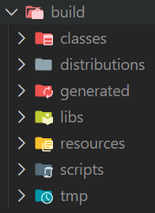

# Cinéma - Gestion de franchise

## Architecture
```
├── bin                  # fichiers .class
├── build.gradle.kts     # Instructions de build écrites en Kotlin DSL
├── gradle               # Contient le wrapper de Gradle
│   └── wrapper
├── gradlew             # binaire de gradle
├── gradlew.bat         # script de lancement de gradle
├── README.md           # informations importantes du projet
├── settings.gradle.kts # défition du build Gradle
├── sql                 # scripts SQL utiles
└── src                 
    └── main            
        ├── java        # répertoire des fichiers sources
        │   └── cinema
        │       ├── BO
        │       ├── controllers
        │       └── DAO           # Accès aux données de la BDD
        └── resources
            └── cinema
                ├── images        # obvious
                └── views         # vues décrites en FXML
```
## Notes aux développeurs

### Gradle

Le projet utilise Gradle comme outil de build. La commande qu'il faut utiliser est ``gradlew``. Le mécanisme principal est celui des [tâches](https://docs.gradle.org/current/userguide/base_plugin.html#sec:base_tasks)

#### Ré-init
``./gradlew init`` : Réinitialise les outils de build de Gradle. Met à jour le wrapper, les scripts de lancement, etc.


#### Compiler

``./gradlew classes`` : compile les classes Java et crée un répertoire ``./build/`` contenant les fichiers bytecode de l'application.

``./gradlew assemble`` : génère les livrables de l'application (.zip, .tar, .jar)



#### Tests unitaires
``./gradlew test`` : lance les tests unitaires (ex. JUnit tests)

#### Nettoyer
``./gradlew clean`` : nettoie tout le répertoire ``./build/``

#### Lancer l'application
``./gradlew run`` : Lance l'application

### PostgreSQL

Un utilisateur pouvant se connecter à votre serveur doit être créé :

```sql
CREATE USER mon_nouvel_user WITH PASSWORD 'mot_de_passe_securise';
```

Ensuite, il est nécessaire d'autoriser l'utilisateur a se connecter à la base de données :

```sql
-- 1. Droit de se connecter à la base spécifique
GRANT CONNECT ON DATABASE nom_de_votre_bdd TO mon_nouvel_user;

-- 2. Droit d'utiliser le schéma public
GRANT USAGE ON SCHEMA public TO mon_nouvel_user;
```

Enfin, il faut donner les droits en lecture/écriture :
```sql
-- 1. Droits complets (Select, Insert, Update, Delete) sur les tables actuelles
GRANT SELECT, INSERT, UPDATE, DELETE ON ALL TABLES IN SCHEMA public TO mon_nouvel_user;

-- 2. TRES IMPORTANT : Droits sur les séquences (pour les ID auto-incrémentés)
GRANT USAGE, SELECT ON ALL SEQUENCES IN SCHEMA public TO mon_nouvel_user;

-- 3. Pour que ces droits s'appliquent aussi aux FUTURES tables créées :
ALTER DEFAULT PRIVILEGES IN SCHEMA public GRANT SELECT, INSERT, UPDATE, DELETE ON TABLES TO mon_nouvel_user;
ALTER DEFAULT PRIVILEGES IN SCHEMA public GRANT USAGE, SELECT ON SEQUENCES TO mon_nouvel_user;
```

